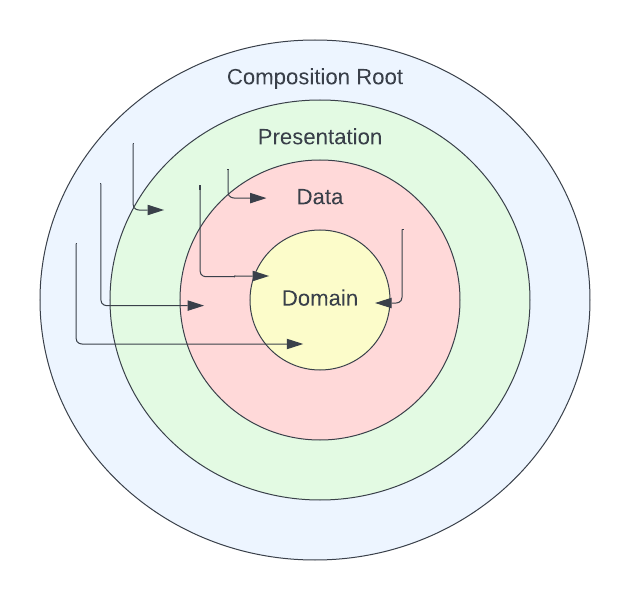

# modular_flutter

A Flutter project to PoC modularisation.

## 4 Layer Architecture

### Composition Root

* Houses the app's main starting point
* _Can_ depend on any layer below it, but likely wouldn't need to (at least directly)

### Presentation

* Houses the views / widgets
* Defines the Providers since they are ultimately consumed by the presentation layer
* Because Providers are defined here, this layer may depend on data and domain layers
* This layer would also define UI-motivated objects, such as `ChangeNotifier`s and `StateNotifier`s, which we
    essentially only care about for view-related reasons

### Data

* Can also be referred to as an Infrastructure layer. This layer may handle DB / HTTP connections or device API 
    interactions, for example
* Houses implementations of abstractions that the domain layer defines (e.g., `InMemoryDriverBreakStateRepository`
    in the `data` package implements `DriverBreakStateRepository` abstraction defined in the `domain` package)
* Can only depend on the domain layer, it cannot depend on the Composition Root outside it

### Domain

* Also often referred to as a Business Logic layer
* With this reduced '4 layer architecture', this would contain not only core business-oriented objects like `Route` and
    `Drop`, but also use cases or other service-oriented classes that compose other objects to achieve some result
* 'Software in a vacuum': objects at this layer depend only on abstractions, no actual Input / Output can be
    implemented at this layer. We should be able to port this code to a web or desktop app with completely different
    IO technologies and for it to still be relevant.

## Pros

* Separating out a presentation layer helps keep the main root of the app very thin.

## Cons

* The lack of an 'application' layer means that objects that the business should care about, like `Route` and `Drop`
    get confused with more implementation-focused objects like `DriverBreaksUseCase` that the business would have no
    concept of. This can muddy rules for core domain concepts
