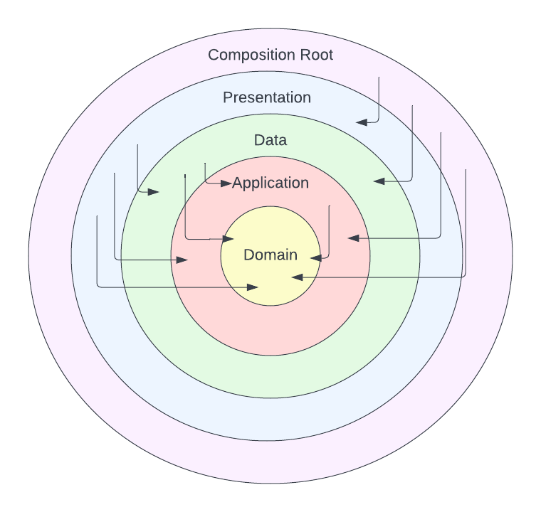

# modular_flutter

A Flutter project to PoC modularisation.

## 5 Layer Architecture

### Composition Root

* Houses the app's main starting point
* _Can_ depend on any layer below it, but likely wouldn't need to (at least directly)

### Presentation

* Houses the views / widgets
* Defines the Providers since they are ultimately consumed by the presentation layer
* Because Providers are defined here, this layer may depend on data and domain layers
* This layer would also define UI-motivated objects, such as `ChangeNotifier`s and `StateNotifier`s, which we
    essentially only care about for view-related reasons

### Data

* Can also be referred to as an Infrastructure layer. This layer may handle DB / HTTP connections or device API 
    interactions, for example
* Houses implementations of abstractions that the domain layer defines (e.g., `InMemoryDriverBreakStateRepository`
    in the `data` package implements `DriverBreakStateRepository` abstraction defined in the `domain` package)
* Can only depend on the application and domain layers, it cannot depend on the layers outside it

### Application

* Service-oriented classes (such as 'use cases', 'manager's etc.) would be found here which would compose other
    application-level and domain-level objects / abstractions to achieve some result
* 'Software in a vacuum': objects at this layer depend only on abstractions, no actual Input / Output can be
    implemented at this layer. We should be able to port this code to a web or desktop app with completely different
    IO technologies and for it to still be relevant.

### Domain

* Also often referred to as a Business Logic layer
* With a separate application layer, this layer would only hold objects that model core business-oriented concepts,
    such as `Route` or `Drop`
* 'Software in a vacuum': objects at this layer depend only on abstractions, no actual Input / Output can be
    implemented at this layer. We should be able to port this code to a web or desktop app with completely different
    IO technologies and for it to still be relevant.

## Pros

* Separating out a presentation layer helps keep the main root of the app very thin.
* Separating out an application layer helps model how the application (while disregarding the environment the
    application runs in, e.g. Android app / Web app / Desktop app) behaves without muddying the core domain modeling

## Cons

* The number of layers may appear quite large to developers, which can make it harder at first to know where to put
    code. However, with familiarity of the intention of the layers comes even more clarity where code should sit.
    The separation between application-layer and domain-layer code can be less clearly defined than say the difference 
    between DB-interacting code and a domain model
